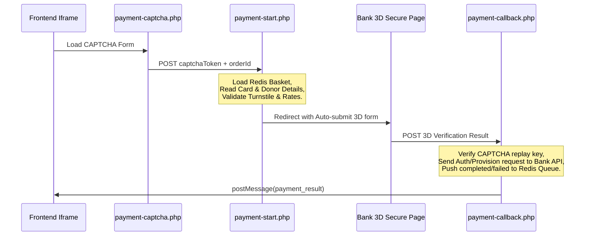

# KADIM CRM & WordPress Integration Reference Guide

This document provides a comprehensive, self-contained reference guide for integrating the WordPress front-end theme with the CRM system via the **KADIM CRM Bridge** plugin and the low-level `_esas/` API gateway directory.

---

## 1. System Architecture

The CRM integration is split into two distinct parts:
1. **`wp-content/plugins/kadim-crm-bridge/` (PHP SDK & Plugin)**: Handles back-end logic, REST API endpoints, ACF product pickers, and theme helper integrations.
2. **`_esas/` (Root API Gateway)**: Located at the WordPress root directory. It runs outside the WordPress lifecycle for maximum speed, handling high-concurrency operations like shopping cart modifications, GraphQL proxying, and bank 3D Secure payment flows.

### Core Data Storage (Redis)
Both systems share a Redis instance to manage sessions, cart state, and payments. Redis keys are prefixed based on the environment (e.g., `local:`, `canyoldasi:`, `sebepol:`).

- **Cart State**: `basket:{sessionId}` (Gateway) and `cart:{token}` (Plugin).
- **Payment Security & State**:
  - `payment:amount:{orderId}`: Holds the total payment amount.
  - `payment:bank:{orderId}`: Holds the targeted bank identifier (`vk`, `zk`, `tf`).
  - `payment:captcha:{orderId}`: OTP/CAPTCHA replay prevention flag (1-hour TTL).
  - `payment:card:{orderId}`: Temporarily caches credit card details (15-minute TTL) for Türkiye Finans 3D callback finalization.
  - `payment:result:{orderId}`: Caches payment results for frontend polling (5-minute TTL).
  - `payment:inbox` (Redis List): Queue for asynchronous workers to process payment events.

---

## 2. Authentication Flow (Login & Register)

The authentication system uses a passwordless OTP (One-Time Password) flow over a phone number. Registration is automatic: if the phone number is not registered, the CRM registers the user upon successful OTP verification.

All frontend authentication calls go through the gateway proxy at `/_esas/gateway.php`.

### Phase 1: Request OTP (`endUserSendOtp`)
Sends a 6-digit verification code to the user's phone number.

- **Endpoint**: `POST /_esas/gateway.php`
- **GraphQL Mutation**:
  ```graphql
  mutation endUserSendOtp($phone: String!) {
    endUserSendOtp(phone: $phone)
  }
  ```
- **Payload**:
  ```json
  {
    "operationName": "endUserSendOtp",
    "query": "mutation endUserSendOtp($phone: String!) { endUserSendOtp(phone: $phone) }",
    "variables": {
      "phone": "+905551112233"
    }
  }
  ```
- **Response**:
  ```json
  {
    "data": {
      "endUserSendOtp": true
    }
  }
  ```

### Phase 2: Verify & Log In (`endUserLogin`)
Verifies the OTP code and retrieves a JWT authentication token.

- **Endpoint**: `POST /_esas/gateway.php`
- **GraphQL Mutation**:
  ```graphql
  mutation endUserLogin($phone: String!, $otp: String!) {
    endUserLogin(phone: $phone, otp: $otp)
  }
  ```
- **Payload**:
  ```json
  {
    "operationName": "endUserLogin",
    "query": "mutation endUserLogin($phone: String!, $otp: String!) { endUserLogin(phone: $phone, otp: $otp) }",
    "variables": {
      "phone": "+905551112233",
      "otp": "123456"
    }
  }
  ```
- **Response Handling**:
  The GraphQL gateway interceptor in `_esas/gateway.php` checks if `endUserLogin` returned a valid JWT. It then writes it as an **HttpOnly**, **Secure** (if not localhost), **SameSite=Strict** cookie named `endUserToken` (valid for 100 days).
  
  Subsequent queries automatically transmit this token, which `Esas::request()` intercepts and injects as an `Authorization: Bearer <token>` header.

---

## 3. Donation Product Catalog

The product catalog holds the hierarchical structure of categories and products configured in the CRM.

- **GraphQL Query**: `getCategoriesWithProducts`
- **Fields Whitelisted**:
  - `id`, `name`, `code`, `sequence`, `isGroupSelling`, `allowSale`
  - `coverPhoto { publicUrl }`
  - `categoryCountries { country { id name } }`
  - `categoryIntentVariants { intentVariant { id name } }`
  - `categoryIntentPurposes { intentPurpose { id name } }`
  - `products { id name price sequence isActive allowSale country { id } intentVariant { id } }`

### Catalog Tree Mapping
The `CatalogBrowser` class parses this tree into a normalized array:
- **Static Pricing**: If `price` is set (e.g. 500), it's a fixed-price donation.
- **Variable Pricing**: If `price` is `null` or `0`, it is a custom-amount donation.
- **Qurban Settings**: Fields like `allowPersonName`, `allowQuantitySelection`, and `isQurban` specify if the user can enter a dedicated person name (e.g., adak, kurban names) or custom quantities.

---

## 4. Shopping Cart Management

The cart operates in two layers:
1. **Front-End & Plugins layer**: WordPress REST API and form endpoints.
2. **Gateway layer**: High-speed, session-based cart operations directly modifying Redis `basket:{sessionId}`.

### Front-End PHP REST Endpoints (WordPress)
Managed by `Hiyad\Bridge\Rest\CartRoutes`:
- `GET /wp-json/hiyad/v1/cart`: Gets the normalized cart.
- `POST /wp-json/hiyad/v1/cart/items`: Adds a product to the cart.
  - Requires `product_code` and `quantity`. Optionally accepts `unit_amount` (for variable amount donations).
- `DELETE /wp-json/hiyad/v1/cart/items/{lineKey}`: Removes item.
- `DELETE /wp-json/hiyad/v1/cart`: Clears the cart.

### Gateway Cart API (`_esas/basket.php`)
This file accepts JSON POST payloads with an `action` parameter:
- **Actions**:
  - `add`: Adds a row to the basket.
  - `syncCard`: Synchronizes a whole group of kurban/adak card rows.
  - `remove`: Removes a row by index.
  - `removeCard`: Removes all rows matching a specific `cardKey`.
  - `removeRoot`: Removes all rows matching a specific `rootCategoryId`.
  - `update`: Updates quantity, amount, personName, personPhone, or intentPurposeId of a specific row by index.
  - `updateDonor`: Updates overall donor info (`name`, `phone`, `note`).
  - `updateCard`: Updates credit card info (`holderName`, `number`, `expiry`, `cvv`) temporarily.
  - `clear`: Clears the sepet.
  - `get`: Returns the current sepet enriched with category names, titles, and total calculations.

---

## 5. Checkout & Payment Flow

Payments run entirely in an **iframe-first** lifecycle. The gateway handles rate limiting, turnstile verification, card validation, and 3D Secure bank redirects.



### Rate Limiting & CAPTCHA
- **Rate Limit**: Restricts to 20 payment attempts per 60 minutes per IP. Exceeding 80 attempts bans the IP for 24 hours.
- **Turnstile Captcha**: Verified using Cloudflare Turnstile Siteverify. If Cloudflare is unreachable, it acts as **fail-open** but alerts the administrator.

### Bank Integrations

#### 1. Ziraat Katılım (ZK) — 3DModel
- **Step 1 (Start)**: Generates a secure hash string:
  `sha1(MbrId + OrderId + PurchAmount + OkUrl + FailUrl + TxnType + InstallmentCount + Rnd + MerchantPass)`
  Renders an auto-submitting HTML form to `https://vpos.ziraatkatilim.com.tr/Mpi/Default.aspx`.
- **Step 2 (Callback)**: Receives `3DStatus` (must be `'1'`). Completes the payment by POSTing `RequestGuid`, `OrderId`, `UserCode`, `UserPass`, and `SecureType="3DModelPayment"` (urlencoded form-data) to the bank.

#### 2. Türkiye Finans (TF) — NestPay / Asseco-Payten
- **Step 1 (Start)**: Sorts variables case-insensitively (`natcasesort`), escapes special characters `\` and `|`, joins them with `|` followed by the business `storeKey`, and hashes it with SHA-512 (base64 encoded). Renders an auto-submitting HTML form to `https://sanalpos.turkiyefinans.com.tr/fim/est3Dgate`.
- **Step 2 (Callback)**: Verifies the response hash. Reads the card details previously cached in Redis (`payment:card:{orderId}`). Sends a `CC5Request` XML payload using `Type="Auth"` and `CardholderPresentCode="13"` to `https://sanalpos.turkiyefinans.com.tr/fim/api` to finalize the payment.

#### 3. Vakıf Katılım (VK) — ThreeDModelPayGate
- **Step 1 (Start)**: Sends an XML `VPosMessageContract` directly via CURL to the bank's gateway. The bank returns the auto-submitting HTML redirect form.
- **Step 2 (Callback)**: Verifies `ResponseCode` is `'00'`. Posts a second XML payload with the `MD` code to `ThreeDModelProvisionGate` to complete the transaction.

### Redis Event Logging (`payment:inbox`)
Once the payment is completed or fails, the callback script pushes an event to `payment:inbox`.

- **`payment_initiated` Event**:
  ```json
  {
    "event": "payment_initiated",
    "orderId": "ORD-12345",
    "bank": "tf",
    "amount": 250.00,
    "donorName": "Ahmet Yılmaz",
    "donorPhone": "+905551112233",
    "cardNumber": "4355 **** **** 1111",
    "products": [{"productId": "prod_1", "quantity": 1, "amount": 250.00}]
  }
  ```
- **`payment_completed` Event**:
  ```json
  {
    "event": "payment_completed",
    "orderId": "ORD-12345",
    "transactionId": "TX-998877",
    "provisionNumber": "AUTH-1234",
    "bankResponseCode": "00",
    "amount": 250.00,
    "paidAt": "2026-06-04T21:05:00+03:00"
  }
  ```

---

## 6. My Account & Donation History

If the `endUserToken` cookie is present, you can query personal information and donation history from the CRM via `/_esas/gateway.php`.

### User Profile (`endUserMe`)
- **Query**:
  ```graphql
  query {
    endUserMe {
      id
      name
      phone
    }
  }
  ```

### Donor Summary Metrics (`getDonorSummary`)
- **Query**:
  ```graphql
  query {
    getDonorSummary {
      totalDonationAmount
      donationCount
      lastDonationAt
    }
  }
  ```

### Transaction History (`getTransactions`)
Retrieves a list of completed payments made by the user.

- **Query**:
  ```graphql
  query {
    getTransactions {
      items {
        id
        amount
        status
        createdAt
        orderId
      }
      total
      page
      limit
      totalPages
    }
  }
  ```
