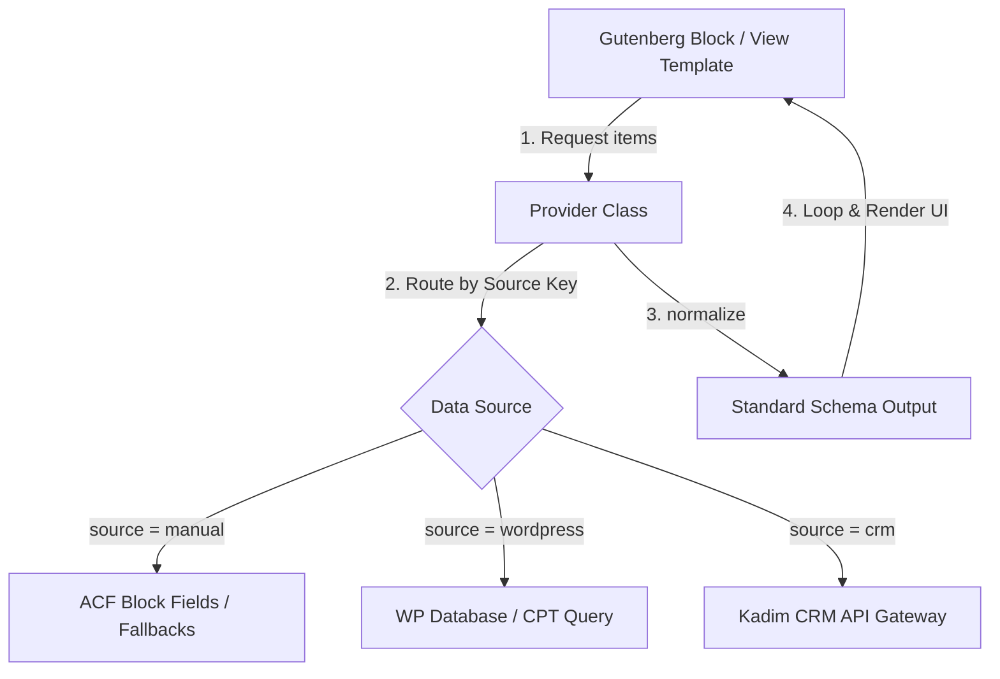

# Dernek Tema - Data Provider Layer v1

Bu kılavuz, kullanıcı arayüzü (Gutenberg blokları ve sayfa şablonları) ile veri kaynağı (manuel girişler, WordPress veritabanı ve CRM entegrasyonu) katmanlarını birbirinden ayıran **Data Provider Layer** yapısını açıklar.

---

## 1. Mimari Genel Bakış

Dernek Starter Theme, beyaz etiketli (white-label) bir yapı olarak tasarlanmıştır. Gelecekte CRM entegrasyonları, ödeme ağ geçitleri veya veritabanı değişiklikleri yapıldığında şablon ve blok kodlarının değiştirilmesini önlemek amacıyla **Data Provider** katmanı kurulmuştur.

Gutenberg blokları veya WordPress şablonları, verinin nereden geldiğini (`manual`, `wordpress` veya `crm`) bilmez. Sadece ilgili **Provider** sınıfını çağırarak standartlaştırılmış veriyi tüketir.



---

## 2. Standart Arayüz: `ProviderInterface`

Tüm veri sağlayıcı sınıflar [ProviderInterface.php](file:///c:/laragon/www/dernekwp/wp-content/themes/dernek-tema/app/providers/ProviderInterface.php) arayüzünü uygular.

```php
interface ProviderInterface {
    public static function getItems( string $source, array $args = [] ): array;
    public static function getItem( string $source, $id, array $args = [] ): ?array;
    public static function normalize( $raw_data, string $source ): array;
}
```

- **`getItems( $source, $args )`**: İlgili veri kaynağından filtrelenmiş eleman listesini döner.
- **`getItem( $source, $id, $args )`**: Tek bir kaydı benzersiz anahtarı veya kimliği ile getirir.
- **`normalize( $raw, $source )`**: Gelen ham veri nesnesini/dizisini ortak şablon formatına dönüştürür.

---

## 3. Sağlayıcılar & Veri Yapıları

Tüm sağlayıcılar [app/providers/](file:///c:/laragon/www/dernekwp/wp-content/themes/dernek-tema/app/providers/) dizini altında toplanmıştır.

### A. DonationProvider
Bağış fonlarını ve kategorilerini yönetir.

- **Ortak Veri Yapısı (Schema)**:
  - `id` (String): Benzersiz kimlik
  - `code` (String): Ürün veya kategori kodu (örn: `YETIM_SPONSOR`)
  - `title` (String): Kampanya/Fon adı
  - `description` (String): Açıklama metni
  - `image_url` (String): Kart kapak görseli URL'i
  - `donation_url` (String): Hızlı bağış sayfasına yönlendirme adresi
  - `price` (Float|null): Sabit bağış miktarı (değişken bağış ise `null`)
  - `is_intent` (Boolean): Adak/Kurban vb. isim beyanı gerektirip gerektirmediği

---

### B. ProjectProvider
CPT veya CRM üzerinde barındırılan yardım projelerini yönetir.

- **Ortak Veri Yapısı (Schema)**:
  - `id` (String|Int): Proje kimliği
  - `code` (String): Proje slug adı veya kampanya kodu
  - `title` (String): Proje adı
  - `description` (String): Kısa açıklama
  - `content` (String): Detaylı HTML içeriği
  - `image_url` (String): Kapak fotoğrafı
  - `url` (String): Proje detay sayfası linki
  - `collected_amount` (Float): Toplanan bağış tutarı
  - `target_amount` (Float): Hedeflenen bağış tutarı
  - `percentage` (Int): İlerleme yüzdesi (0-100)
  - `is_active` (Boolean): Kampanyanın açık olup olmadığı

---

### C. StatsProvider
Dernek etki ve başarı istatistiklerini yönetir.

- **Ortak Veri Yapısı (Schema)**:
  - `id` (String): İstatistik anahtarı (örn: `wells_count`)
  - `icon` (String): RemixIcon veya Dashicons ikon sınıfı
  - `value` (String): Biçimlendirilmiş gösterge değeri (örn: `4.200+`, `1.2M+`)
  - `title` (String): İstatistik başlığı
  - `description` (String): Kısa açıklama

---

### D. GalleryProvider
Medya albümlerini, fotoğraf ve video galerilerini yönetir.

- **Ortak Veri Yapısı (Schema)**:
  - `id` (String): Dosya veya kayıt ID
  - `type` (String): Medya türü (`image` veya `video`)
  - `url` (String): Görsel veya video oynatma adresi (YouTube/Vimeo vb.)
  - `thumbnail_url` (String): Önizleme görsel adresi
  - `title` (String): Başlık veya alternatif metin

---

## 4. Kullanım Örnekleri (Gutenberg Entegrasyonu)

### Örnek: Öne Çıkan Bağışlar Bloğu (`featured-donations.php`)

Bloğun veri çekme ve listeleme aşaması aşağıdaki şekilde güncellenerek CRM entegrasyonuna hazır hale getirilebilir:

```php
<?php
/**
 * Block View: Featured Donations
 */

// 1. Veri kaynağını belirle (ACF panelinden 'manual' veya 'crm' seçilebilir)
$source_type = get_field('source_type') ?: 'manual';

// 2. Provider üzerinden veriyi çek
$donations = DonationProvider::getItems( $source_type, [
    'cards' => get_field('cards') // Manuel girişler için ACF verisini pasla
] );

// 3. UI Katmanı - Sadece listele
if ( ! empty( $donations ) ) : ?>
    <div class="grid grid-cols-1 md:grid-cols-3 gap-component-lg">
        <?php foreach ( $donations as $card ) : 
            ob_start();
            get_template_part( 'resources/components/button', null, [
                'variant' => 'primary',
                'size'    => 'small',
                'text'    => 'Bağış Yap',
                'url'     => $card['donation_url']
            ] );
            $card_footer = ob_get_clean();

            get_template_part( 'resources/components/card', null, [
                'title'     => $card['title'],
                'subtitle'  => 'Bağış Kampanyası',
                'image_url' => $card['image_url'],
                'content'   => '<p>' . esc_html( $card['description'] ) . '</p>',
                'footer'    => $card_footer,
                'url'       => $card['donation_url']
            ] );
        endforeach; ?>
    </div>
<?php endif; ?>
```

Bu yapı sayesinde:
1. `source_type` değeri `'manual'` ise editörün ACF paneline girdiği veriler kullanılır.
2. `source_type` değeri `'crm'` yapıldığı anda hiçbir HTML, CSS veya PHP şablon yapısı bozulmadan veriler doğrudan **Kadim CRM API** üzerinden canlı çekilmeye başlanır.
